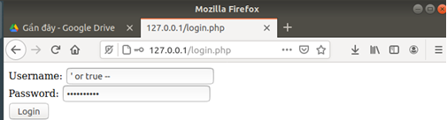
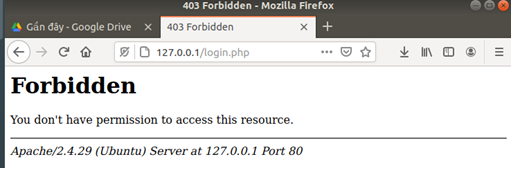

### HƯỚNG DẪN SỬ DỤNG DEMO BẢO MẬT WEBSITE NHÓM 10

## Modsecurity

### Installing ModSecurity
    $su
### 
    # sudo apt-get install libapache2-mod-security2 –y

###
    #sudo apachectl -M | grep --color security2
###
    #sudo mv /etc/modsecurity/modsecurity.conf-recommended /etc/modsecurity/modsecurity.conf
###
    #sudo service apache2 reload

### Configuring ModSecurity

    #sudo sed -i "s/SecRuleEngine DetectionOnly/SecRuleEngine On/" /etc/modsecurity/modsecurity.conf
###
    #sudo sed -i "s/SecResponseBodyAccess On/SecResponseBodyAccess Off/" /etc/modsecurity/modsecurity.conf

### Testing an SQL Injection

    #mysql -u root -p
###
    mysql> create database sample;
###
    mysql> connect sample;
###
    mysql> create table users(username VARCHAR(100),password VARCHAR(100));
###
    mysql> insert into users values('sammy','password');
###
    mysql> quit;
<div style="page-break-after: always"></div>

[Fix MySQL Error: : 'Access denied for user 'root'@'localhost'](https://stackoverflow.com/questions/41645309/mysql-error-access-denied-for-user-rootlocalhost)

```
#sudo nano /var/www/html/login.php
```

    <html>
    <body>
    <?php
        if(isset($_POST['login']))
        {
            $username = $_POST['username'];
            $password = $_POST['password'];
            $con = mysqli_connect('localhost','root','your_mysql_password','sample');
            $result = mysqli_query($con, "SELECT * FROM `users` WHERE username='$username' AND password='$password'");
            if(mysqli_num_rows($result) == 0)
                echo 'Invalid username or password';
            else
                echo '<h1>Logged in</h1><p>This is text that should only be displayed when logged in with valid credentials.</p>';
        }
        else
        {
    ?>
            <form action="" method="post">
                Username: <input type="text" name="username"/><br />
                Password: <input type="password" name="password"/><br />
                <input type="submit" name="login" value="Login"/>
            </form>
    <?php
        }
    ?>
    </body>
    </html>

####Setting Up Rules

    #sudo mv /usr/share/modsecurity-crs /usr/share/modsecurity-crs.bk

    #sudo git clone https://github.com/SpiderLabs/owasp-modsecurity-crs.git /usr/share/modsecurity-crs

<div style="page-break-after: always"></div>

(Cần tải git nhé: apt install git –y)

    #sudo cp /usr/share/modsecurity-crs/crs-setup.conf.example /usr/share/modsecurity-crs/crs-setup.conf`

    #sudo nano /etc/apache2/mods-enabled/security2.conf

Thêm vào 2 dòng sau:

    IncludeOptional /usr/share/modsecurity-crs/*.conf
###
    IncludeOptional "/usr/share/modsecurity-crs/rules/*.conf
    
    < IfModule security2_module>
    …
    IncludeOptional /usr/share/modsecurity-crs/*.conf
    IncludeOptional "/usr/share/modsecurity-crs/rules/*.conf
    </IfModule>
###
    #sudo service apache2 reload

<div style="page-break-after: always"></div>

#### TEST




<div style="page-break-after: always"></div>

### Session Base Authorization

><strong>Sử dụng sau quá trình hash password. </strong>

><em>Mô tả: Sinh ra Access Token và cập nhật Access Token vào trong database mỗi lần login. </em>

    $con = new mysqli("localhost","root","","demo");
    $con -> set_charset("utf8");
    $sql = "SELECT * from user
    where uname = '".$uname ."' and passwd = '".$mk."'
    ";
    $result = $con->query($sql);
    if( $result->num_rows > 0){
        while($row = $result->fetch_assoc()){
            $tk = $row['uname'];
            // Mỗi lần login tự sinh ra SSID
            session_regenerate_id();
            $authTOken = session_id();
            $_SESSION['uname'] = $tk;
            $authSqlQuery = "UPDATE user set auth_token = '$authTOken' where uname = '$tk'";
            $result = $con->query($authSqlQuery);
            // Chuyển hướng sang auth
            if($result){
                header("Location:  http://localhost:8080/demo/auth/auth.php");
                exit();
            }
        }
    } else{
        echo "fail!!";
    }
    $con->close();

<div style="page-break-after: always"></div>

><strong> Sử dụng mỗi lần user muốn truy cập vào một tài nguyên nào đó …</strong>
>

>
><em>Mô tả: Lấy ra Token từ database và kiểm tra xem nó có hợp lệ hay không …</em>

      // Lấy ra token 
    $sql = "SELECT auth_token,id from user
    where uname = '" . $uname . "'";
    $result = $con->query($sql);
    if ($result->num_rows > 0) {
        while ($row = $result->fetch_assoc()) {
            $x = $row['auth_token'];
            $authToken = $x;
            $id = $row['id'];
            if ($authToken != $_COOKIE['PHPSESSID']) {
                header("Location: http://localhost:8080/index.html");
                exit();
            }
        }
    }

<div style="page-break-after: always"></div>

### Role Base Authorization
><strong> Lưu ý các role đã được mình nhập tay vào trong database nên không đoạn insert role vào DB nhé.</strong>

><strong>Sử dụng sau quá kiểm tra token đã đề cập phía trên.<strong>

><em>Mô tả: Redirect user sang trang web phù hợp với vai trò của họ.
Ví dụ: user sau khi login thì sẽ được chuyển hướng sang trang user…</em>


    // Lấy ra các role để phân quyền
    $authSql = "SELECT * from authorization
    where iduser = '".$id ."'";
    $res = $con->query($authSql);
    if( $res->num_rows > 0){
        while($row = $res->fetch_assoc()){
            $roleAdmin = $row['role_admin'];
            $roleSv = $row['role_sinhvien'];
            if($roleAdmin == 1){
                header("Location: http://localhost:8080/demo/admin/dashboard.php?id=1");
                exit();
            } else{
                header("Location: http://localhost:8080/demo/sinhvien/sinhvien.php?id=$id");   
                exit();
            }
        }
    }

<div style="page-break-after: always"></div>

><strong> Sử dụng khi mỗi lần user truy cập vào một tài nguyên nào đó. Ta sẽ kiểm tra lại token và role của họ có cho phép điều đó xảy ra hay không !</strong>

><em> Mô tả: Kiểm tra role </em>

><em> Trang admin hay User chỉ khác nhau ở role được lấy ra … Các bạn có thể xử lý tương tự với trang admin nhé.</em>

    // Kiểm tra role
    $authSql = "SELECT * from authorization
    where iduser = '" . $id . "'";
    $res = $con->query($authSql);
    if ($res->num_rows > 0) {
        while ($row = $res->fetch_assoc()) {
            $roleSinhvien = $row['role_sinhvien'];
            if ($roleSinhvien == 0) {
                header("Location: http://localhost:8080/demo/admin/403page.php"); 
            } else {
                $idsv = $_GET['id']; }
            }
        }
    }

<div style="page-break-after: always"></div>

### Broken Access Control

><strong> Hãy chú ý tới dòng code sau … </strong>

    // Kiểm tra role
    $authSql = "SELECT * from authorization
    where iduser = '" . $id . "'";
    $res = $con->query($authSql);
    if ($res->num_rows > 0) {
        while ($row = $res->fetch_assoc()) {
            $roleSinhvien = $row['role_sinhvien'];
            if ($roleSinhvien == 0) {
                header("Location: http://localhost:8080/demo/admin/403page.php"); 
            } else {
                // Vấn đề nằm ở đây…
                // --------------------
                $idsv = $_GET['id'];
                // --------------------
               }
            }
        }
    }

><em>Ta có thể dễ dàng thấy được idsv được lấy từ $_GET[‘id’] chính vì vậy nếu người dùng thay đổi slug id của họ trên url thì họ có thể dễ dàng truy cập vào tài khoản của người dùng khác một cách dễ dàng mà không cần đến password và quan trọng hơn là nó đã vượt qua được quá trình kiểm tra Access Token và Role một cách bình an…</em>

<div style="page-break-after: always"></div>

### Giải pháp

> <strong>Cải tiến lại đoạn code vừa rồi … </strong>

><em> So sánh id của  chủ token với id trên url nếu trùng thì cho tiếp tục truy cập ngược lại thì redirect sang trang có id của chủ token.</em>
 
    // Kiểm tra role
    $authSql = "SELECT * from authorization
    where iduser = '" . $id . "'";
    $res = $con->query($authSql);
    if ($res->num_rows > 0) {
        while ($row = $res->fetch_assoc()) {
            $roleSinhvien = $row['role_sinhvien'];
            if ($roleSinhvien == 0) {
                header("Location: http://localhost:8080/demo/admin/403page.php"); 
            } else {
                // idsv là id của user đã sở hữu token còn id kia là lấy trong GET
                $idsv = $_GET['id'];
                if($idsv != $id){
                    header("Location: http://localhost:8080/demo/sinhvien/sinhvien.php?id=$id");   
                 }
            }
        }
    }

><strong><em> Source code chưa được clean … Nếu các bạn cảm thấy hoa mắt chống mặt thì cho mình xin lỗi :< </em></strong>